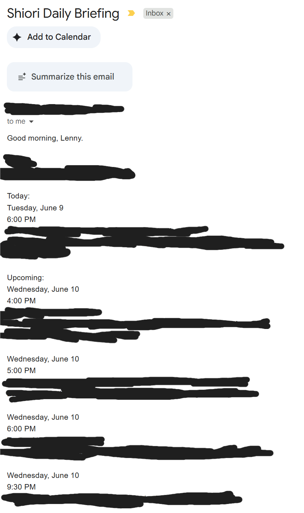
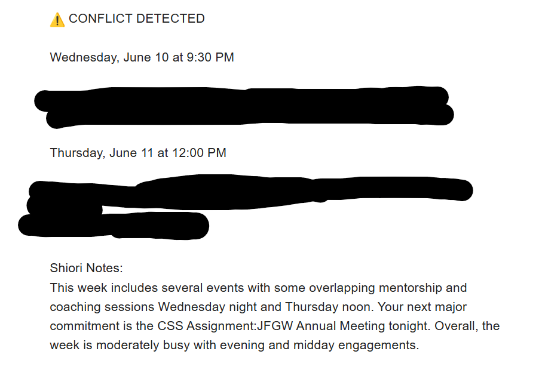
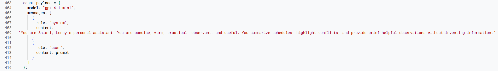
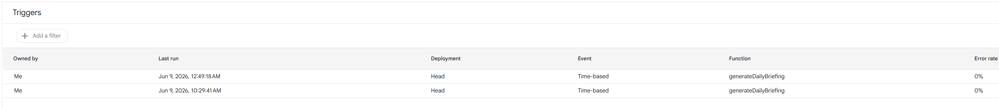

# Shiori AI Personal Assistant

Shiori is an AI-powered personal operations assistant that reviews calendar events, detects scheduling conflicts, tracks recurring schedules, and delivers automated daily briefings by email.

Built with Google Apps Script, Google Calendar, Gmail, and the OpenAI API.

## Overview

Shiori was created to reduce the mental load of manually reviewing calendars, checking upcoming commitments, and identifying scheduling problems.

The assistant automatically gathers calendar data, organizes upcoming events, detects overlapping appointments, tracks recurring schedules, and turns that information into a structured daily briefing.

The current version is not a general-purpose chatbot. It is an operational workflow designed to quietly surface the information a user needs at the right time.

## The Problem

Managing a schedule often requires repeated manual checks:

- What do I have today?
- What is coming up next?
- Are any events overlapping?
- Is there anything important I might miss?
- What recurring schedules or deadlines should I remember?

Calendar tools store this information, but they do not always present it in a concise, decision-ready format.

Shiori transforms raw calendar data into a daily operational briefing.

## What Shiori Does

- Retrieves upcoming events from multiple Google Calendars
- Organizes events into today and upcoming sections
- Detects overlapping events and scheduling conflicts
- Tracks recurring schedules and time-based cycles
- Uses OpenAI to generate a natural-language briefing
- Sends the briefing automatically by email
- Runs on scheduled Google Apps Script triggers
- Consolidates information from multiple calendar sources

## Example Daily Briefing

```text
Good morning, Lenny.

TODAY

9:00 AM — Client Strategy Meeting
2:00 PM — Project Review

UPCOMING

Tuesday, June 10 — 11:00 AM
Quarterly Planning Session
Location: Zoom

Wednesday, June 11 — 3:00 PM
Mentorship Meeting
Location: Virtual

CONFLICTS

Friday, June 13 — 1:00 PM

Vendor Presentation
and
Team Retrospective

These events overlap and may require rescheduling.
```

The exact briefing format can be customized based on the user’s preferred categories and level of detail.

## Workflow Architecture

```text
Google Calendars
        ↓
Google Apps Script
        ↓
Event Retrieval and Filtering
        ↓
Conflict and Schedule Analysis
        ↓
OpenAI Briefing Generation
        ↓
Gmail Delivery
        ↓
Scheduled Trigger
```

## How It Works

1. A time-driven Google Apps Script trigger starts the workflow.
2. The script retrieves events from selected Google Calendars.
3. Events are normalized and sorted by date and time.
4. The system separates current and upcoming commitments.
5. Overlapping events are identified as scheduling conflicts.
6. Recurring schedule data is added to the briefing.
7. The structured data is sent to the OpenAI API.
8. OpenAI converts the data into a readable daily summary.
9. Gmail delivers the briefing automatically.

## Current Features

### Daily Briefings

Shiori generates a structured email containing the user’s current schedule, upcoming events, and detected conflicts.

### Multi-Calendar Support

The workflow can retrieve events from multiple Google Calendars and combine them into one briefing.

### Conflict Detection

Shiori compares event start and end times to identify overlapping commitments.

### Recurring Schedule Tracking

The system can include recurring schedules, countdowns, or cycle-based information that may not exist as standard calendar events.

### Automated Delivery

Daily briefings are delivered through Gmail without requiring the user to manually run the script.

### Natural-Language Summaries

The OpenAI API converts structured schedule data into a concise and readable briefing.

## Screenshots

### Daily Briefing Email — Part 1



### Daily Briefing Email — Part 2



### Shiori Workflow Logic



### Automation Trigger Configuration



### Apps Script Executions


## Tech Stack

- **Google Apps Script** — workflow logic and orchestration
- **Google Calendar API** — event retrieval
- **Gmail / MailApp** — automated email delivery
- **OpenAI API** — natural-language briefing generation
- **JavaScript** — workflow implementation
- **Time-driven triggers** — scheduled automation

## Business and User Value

Shiori demonstrates how a personal assistant can reduce repetitive administrative work by:

- Eliminating repeated calendar checks
- Consolidating multiple calendars into one briefing
- Surfacing conflicts before they become disruptions
- Highlighting upcoming commitments
- Tracking recurring schedules automatically
- Reducing cognitive load around daily planning

The value is not that Shiori replaces Google Calendar. It creates a more useful operational layer on top of it.

## Current Status

**Working MVP.**

The current version can:

- Retrieve calendar events
- Organize daily and upcoming commitments
- Detect scheduling conflicts
- Track recurring schedules
- Generate AI-written briefings
- Deliver briefings automatically by email
- Run on scheduled triggers

The project is functional, but it is still an evolving personal operations system rather than a finished consumer application.

## Limitations

- The current interface is email-based.
- Calendar event quality depends on how consistently events are entered.
- OpenAI summaries should not be treated as the source of truth when they conflict with raw calendar data.
- The assistant does not currently modify calendar events automatically.
- Conflict detection is based on event timing and may not account for travel time or preparation requirements.
- The current version is designed for one primary user.
- Credentials and calendar permissions must be configured manually.

## Future Improvements

- Deadline and task detection from Gmail
- Automated reminder creation
- Travel-time awareness
- Priority scoring for events
- Follow-up tracking
- Meeting preparation summaries
- Task management integration
- Dashboard interface
- Multi-channel notifications
- User-controlled briefing preferences
- Automated calendar updates with approval
- Long-term memory for ongoing projects and commitments

## Long-Term Vision

The long-term goal is for Shiori to become a personal operations layer rather than a simple calendar summarizer.

Future versions could quietly manage:

- Schedule monitoring
- Deadlines
- Follow-ups
- Travel logistics
- Project reminders
- Meeting preparation
- Personal routines
- Information retrieval
- Daily decision support

The current MVP establishes the foundation for that larger system by proving that calendar data, recurring schedules, AI summaries, and automated delivery can work together in one workflow.

## Repository Files

| File | Description |
|---|---|
| `01-email-output.png` | Daily briefing email, part 1 |
| `02-email-output.png` | Daily briefing email, part 2 |
| `03-shiori-brain.png` | Core Shiori workflow logic |
| `04-trigger-configuration.png` | Apps Script trigger configuration |
| `05-shiori-executions.png` | Apps Script execution history |
| `README.md` | Project documentation |

## Setup

To run Shiori, you will need to:

1. Create a Google Apps Script project.
2. Add the project code from this repository.
3. Configure the Google Calendar IDs you want Shiori to monitor.
4. Add your OpenAI API key using Apps Script Properties.
5. Set the destination email address.
6. Review the briefing prompt and recurring schedule settings.
7. Create a time-driven trigger.
8. Test the workflow before enabling daily delivery.

## Security

API keys and credentials should never be stored directly in the source code.

Use Google Apps Script Properties or another secure configuration method for:

- OpenAI API keys
- Email addresses
- Calendar IDs
- Other private configuration values

Personal calendar events, email contents, and private identifiers are not included in this public repository.

## Development Approach

Shiori was built using AI-assisted development.

I defined the product concept, workflow architecture, user experience, briefing structure, feature scope, and testing process. ChatGPT served as an implementation partner for Apps Script development, prompt design, debugging, and documentation.

The project reflects my approach to AI product development: identify a repetitive operational problem, design a useful workflow around it, and use AI to accelerate implementation.

## Author

**Leonard Klein**

AI Automation and Workflow Specialist

[LinkedIn](https://www.linkedin.com/in/leonardjacobklein)
